# WhatsApp Watcher — Enunciado del proyecto

> Estado: v1 (borrador para aprobación) · Fecha: 2026-09-06 · Owner: irueda

## 1. Contexto y problema

Hoy las notas, pendientes y avisos operativos se pierden en conversaciones de WhatsApp: llegan como texto,
como foto de una pizarra/etiqueta o como nota de voz, y nadie las estructura ni las recuerda después.

**WhatsApp Watcher** es un *notetaker* conversacional: el usuario manda un mensaje por WhatsApp (texto, imagen
o audio), el sistema lo entiende con IA, lo guarda estructurado y **devuelve una alarma/recordatorio por
WhatsApp** cuando corresponde (a una hora pedida, o cuando se cumple una regla).

El proyecto reutiliza el stack ya probado en JohoFit (TypeScript ESM + Bun, SST v4 sobre AWS, Hono + Zod,
DynamoDB single-table, KAPSO como pasarela de WhatsApp), pero **no comparte tablas ni cuenta lógica** con
`joho-back`: es un servicio independiente con sus propios stages `dev`/`production`.

## 2. Objetivo

Construir un pipeline **event-driven, asíncrono y tolerante a fallos** en AWS que:

1. Reciba mensajes de WhatsApp vía KAPSO.
2. Persista el evento crudo de forma idempotente antes de procesar nada.
3. Procese el contenido con **Amazon Bedrock** (transcripción/descripción + extracción estructurada).
4. Genere notas y **alarmas programadas** que se entregan de vuelta por WhatsApp.
5. Sea **observable y auto-alertante**: si algo falla, el operador se entera por correo, y ningún mensaje se
   pierde silenciosamente (DLQ + redrive).

## 3. Alcance

### Dentro de alcance (v1)

- Ingesta de mensajes de WhatsApp: `text`, `image`, `audio` (nota de voz).
- Interpretación con IA: tipo de nota, resumen, etiquetas, prioridad y fecha/hora del recordatorio expresada
  en lenguaje natural ("recuérdame el viernes a las 8").
- Almacenamiento de la nota estructurada y del media asociado.
- Programación y envío de recordatorios/alarmas por WhatsApp.
- Reglas de alarma simples, evaluadas periódicamente (ver §6.3).
- Manejo de errores con reintentos, DLQ, alarmas operativas y capacidad de reproceso.
- Dashboard y alarmas de CloudWatch, notificación por correo vía SNS.
- Entornos `dev` y `production`, con **fail-closed** en `dev` (allowlist de destinatarios).

### Fuera de alcance (v1)

- Frontend/panel web (la consulta de notas se hace por WhatsApp y por consola/CLI).
- Multi-tenant real con organizaciones y roles (v1 identifica al usuario por su número de teléfono).
- Conversación multi-turno con memoria larga (v1 trata cada mensaje como una unidad).
- Video, PDF, stickers, ubicaciones.
- Búsqueda semántica / RAG sobre el histórico de notas (candidato v2).

## 4. Actores

| Actor | Descripción |
|---|---|
| **Usuario final** | Manda notas por WhatsApp y recibe alarmas en el mismo hilo. |
| **KAPSO** | Pasarela WhatsApp Business: entrega inbound por webhook y expone API para outbound. |
| **Operador / on-call** | Recibe correos de SNS ante fallos; hace redrive de la DLQ. |
| **Sistema (AWS)** | El pipeline descrito abajo. |

## 5. Arquitectura objetivo

> Diagramas interactivos (temas claro/oscuro, vistas guiadas y export PNG/SVG):
> [`arquitectura.html`](./arquitectura.html) — ingesta y proceso ·
> [`arquitectura-salida.html`](./arquitectura-salida.html) — salida y observabilidad.
> Fuentes: los `.architecture.json` del mismo directorio.

```mermaid
flowchart LR
  U[Usuario WhatsApp] -->|mensaje| K[KAPSO]
  K -->|webhook POST| AGW[API Gateway HTTP API]
  AGW --> L1[Lambda ingest]
  L1 -->|PutItem idempotente| DDB[(DynamoDB WatcherMain)]
  DDB -->|stream| OBX[Lambda outbox]
  OBX -->|PutEvents| EB[EventBridge bus watcher]
  EB -->|rule note.received| SQS[SQS note-processing]
  SQS -.->|maxReceiveCount 3| DLQ[SQS DLQ]
  SQS --> L2[Lambda processor]
  L1 -->|media original| S3[(S3 media)]
  S3 -->|lee media| L2
  L2 -->|Converse| BR[Amazon Bedrock]
  L2 -->|nota estructurada| DDB
  L2 -->|note.processed| EB
  L2 -->|schedule one-time| SCH[EventBridge Scheduler]
  EB -->|rule schedule 5 min| L3[Lambda evaluator]
  L3 --> SQS2[SQS alarm-dispatch]
  SQS2 -.-> DLQ2[SQS DLQ alarmas]
  SCH --> SQS2
  SQS2 --> L4[Lambda notifier]
  L4 -->|send message| K
  K -->|alarma| U
  L2 --> CW[CloudWatch Logs y Metrics]
  L4 --> CW
  DLQ --> ALM[CloudWatch Alarms]
  CW --> ALM
  ALM --> SNS[SNS ops-alerts] --> MAIL[Correo del operador]
```

### 5.1 Componentes y responsabilidad

| # | Componente | Responsabilidad | Notas |
|---|---|---|---|
| 1 | **API Gateway (HTTP API)** | Único punto de entrada público. Rutas `POST /webhooks/kapso` y `GET /health`. | Throttling por ruta; access logs a CloudWatch. |
| 2 | **Lambda `ingest`** | Verificar el secret/firma de KAPSO, validar payload con Zod, **descargar el media y guardarlo en S3**, y escribir el evento crudo en DynamoDB de forma **idempotente**. Esa es su **única escritura**: no publica eventos. | Guarda el media porque la URL de KAPSO caduca; nunca llama a Bedrock. Presupuesto: < 5 s con media, < 1 s sin él. |
| 3 | **DynamoDB `WatcherMain`** | Single-table: evento crudo, nota estructurada, recordatorio y regla de alarma. | Stream `NEW_AND_OLD_IMAGES`. **Sin TTL**: el histórico no caduca (§7). |
| 3b | **Lambda `outbox`** | Leer el stream de DynamoDB y publicar `note.received` en EventBridge por cada `INSERT` de un `RAW#`. | Patrón *outbox transaccional*: el evento se deriva de un dato ya confirmado, así que no se pierde ni se inventa. |
| 4 | **EventBridge (bus `watcher-<stage>`)** | Ruteo y desacople: `note.received`, `note.processed`, `alarm.due`, `note.failed`. Además reglas `schedule` para el evaluador. | Permite añadir consumidores nuevos sin tocar el productor. |
| 5 | **SQS `note-processing` (+ DLQ)** | Buffer y reintentos del trabajo pesado. | `maxReceiveCount = 3`; `visibilityTimeout ≥ 6×` el timeout de la Lambda. |
| 6 | **Lambda `processor`** | Leer el media desde S3, invocar Bedrock, construir la nota estructurada, persistirla y programar recordatorios. | `ReportBatchItemFailures` activo (fallos parciales por mensaje). |
| 7 | **OpenAI (vía AI SDK)** | Transcribir audio, describir imagen, clasificar y extraer campos estructurados. | `generateObject` con schema Zod y `transcribe` para las notas de voz. La API key va como SST Secret. Se cambió Bedrock por esto porque **una sola API cubre texto, imagen y audio** y no exige formularios de acceso por proveedor. El adaptador es una implementación de `NoteAnalyzer`: volver a Bedrock es cambiar una clase. |
| 8 | **S3 `watcher-media`** | Guardar el media original (privado, cifrado SSE-S3). Escrito por `ingest` durante la propia petición del webhook. | A partir de ahí solo circula la clave `mediaKey`, nunca los bytes. Lifecycle: transición a clases más baratas a los 30 días, **sin expiración**. |
| 9 | **EventBridge Scheduler** | Un schedule *one-time* por recordatorio (`at(...)`, con timezone del usuario). | Target: SQS `alarm-dispatch`. Se cancela/reprograma si la nota cambia. |
| 10 | **Lambda `evaluator`** | Cada 5 min: evaluar reglas de alarma por estado/umbral y barrer recordatorios vencidos no enviados. | Idempotente por `alarmId#dueAtEpoch`. |
| 11 | **SQS `alarm-dispatch` (+ DLQ)** | Cola de salida: garantiza que un envío fallido a KAPSO se reintenta. | Misma política de redrive. |
| 12 | **Lambda `notifier`** | Enviar el mensaje por KAPSO (template o free-form según la ventana de 24 h) y marcar la alarma como enviada. | **Fail-closed**: en `dev` solo destinatarios de la allowlist. |
| 13 | **CloudWatch** | Logs JSON estructurados, métricas EMF de negocio, dashboard único del pipeline. | `correlationId = messageId` en todos los logs. |
| 14 | **CloudWatch Alarms** | Detectar fallo técnico y de negocio (§8). | Todas apuntan al topic SNS. |
| 15 | **SNS `ops-alerts`** | Fan-out real: un topic y **una suscripción por dirección**, en `OpsEmails` (separadas por comas). Añadir a alguien de guardia no toca el código de las alarmas. | Un topic por stage. Cada dirección debe confirmar su suscripción por correo antes de recibir nada. |
| 16 | **KAPSO** | Inbound (webhook) y outbound (envío de la alarma). | Secret compartido + allowlist en `dev`. |

## 6. Flujos funcionales

### 6.1 Flujo principal — captura de nota

1. El usuario manda "recuérdame llamar al proveedor mañana a las 10" (o una foto, o un audio).
2. KAPSO hace `POST` al webhook con el evento `whatsapp.message.received` (el único al que se suscribe
   la ingesta) y, si hay media, una URL temporal en `message.kapso.media_url`. El *buffering* de KAPSO
   debe quedar **desactivado**: agrupa varios mensajes en un sobre `batch` y rompe la relación 1:1 entre
   mensaje y nota.
3. `ingest` valida el secret; si falla → `401` y métrica `webhook_unauthorized`.
4. Si el mensaje trae media, `ingest` lo descarga **antes de nada más** y lo sube a
   `s3://watcher-media/<stage>/<messageId>` (la URL de KAPSO es temporal y caduca).
5. `ingest` escribe `RAW#<messageId>` con `mediaKey` y `ConditionExpression: attribute_not_exists(pk)`.
   Si ya existe → **duplicado**: responde `200` sin re-emitir (KAPSO reintenta y no debe duplicar notas).
   El orden importa: primero S3, después la clave de idempotencia. Al revés, un reintento tras un fallo de
   subida quedaría deduplicado y perdería el media; así, como mucho, queda un objeto huérfano que el lifecycle
   se lleva.
6. `ingest` responde `200` y termina. **No publica nada**: el `INSERT` viaja por el stream de DynamoDB,
   `outbox` lo transforma en `note.received` (con `mediaKey`, nunca los bytes) y lo publica en EventBridge.
   Así la ingesta tiene una sola escritura que puede fallar, en vez de dos que hay que mantener en sincronía.
7. La regla enruta a `note-processing`; `processor` toma el mensaje.
8. `processor`:
   - lee el media de S3 con la `mediaKey` del evento;
   - llama a Bedrock con el texto/imagen/audio y un schema de salida;
   - obtiene `{ tipo, título, resumen, etiquetas[], prioridad, dueAt?, timezone, confianza }`;
   - escribe `NOTE#<id>` con `status = PROCESSED`;
   - si hay `dueAt`, crea el recordatorio y su schedule en EventBridge Scheduler;
   - emite `note.processed`.
9. `notifier` confirma al usuario: "Anotado ✅ — te aviso mañana 10:00".

### 6.2 Flujo de salida (confirmación y alarma programada)

Todo lo que sale hacia el usuario pasa por la misma cola, `alarm-dispatch`, y por el mismo consumidor. El bus
se reutiliza como ruteador: una regla lleva `note.processed` y `alarm.due` a esa cola.

1. **Confirmación**: `processor` emite `note.processed` → regla → `alarm-dispatch` → `notifier` responde
   "Anotado ✅".
2. **Recordatorio**: llega la hora → EventBridge Scheduler emite `alarm.due` → misma regla → misma cola.
3. `notifier` lee el mensaje, comprueba que la alarma sigue `PENDING` (idempotencia) y envía por KAPSO.
4. Marca `SENT` con `sentAtEpoch`. Si KAPSO devuelve error transitorio → excepción → reintento SQS → **DLQ de
   salida**, con su propia alarma en CloudWatch.

La cola existe justo para esto: sin ella, un fallo de KAPSO al enviar se perdería en el aire.

### 6.3 Flujo de alarma por regla

Reglas soportadas en v1 (declarativas, guardadas por usuario):

- **Urgencia** — si Bedrock clasifica `prioridad = alta`, avisar de inmediato (no espera al evaluador).
- **Silencio** — si el usuario no manda ninguna nota en `N` días, avisar.
- **Pendientes acumulados** — si hay `≥ N` notas `OPEN` con `dueAt` vencido, mandar un resumen diario.

El `evaluator` corre cada 5 min por una regla `schedule` de EventBridge y encola en `alarm-dispatch` lo que
deba dispararse. Toda alarma lleva clave de deduplicación `alarmId#dueAtEpoch` para no repetirse.

### 6.4 Flujo de fallo (requisito explícito del proyecto)

| Punto de fallo | Comportamiento esperado |
|---|---|
| Payload inválido desde KAPSO | `ingest` responde `400`, log de error y métrica; no se encola nada. |
| Firma/secret incorrecto | `401`; alarma si supera umbral (posible abuso). |
| `ingest` no puede descargar o subir el media | Devuelve `5xx` sin escribir la clave de idempotencia → KAPSO reintenta el webhook entero y el media se recupera. |
| `ingest` no puede escribir en DynamoDB | Devuelve `5xx` → KAPSO reintenta; alarma por `5XX` de API Gateway. Como no hay segunda escritura, no existe el caso de "guardado pero nunca anunciado". |
| `outbox` falla al publicar | Lambda reintenta el lote del stream y, agotados los intentos, va a su DLQ. El dato ya está en DynamoDB: el evento se puede reemitir. |
| Bedrock lanza throttling / timeout | El mensaje vuelve a la cola (backoff de SQS), hasta 3 intentos. |
| Fallo permanente al procesar (media corrupto, respuesta no parseable) | Tras 3 intentos → **DLQ**; la nota queda `status = FAILED`; se emite `note.failed`. |
| Mensaje en la DLQ | Alarma `DLQNotEmpty` → SNS → correo al operador con el `messageId`. |
| KAPSO caído al enviar la alarma | Reintentos en `alarm-dispatch`, luego su DLQ; la alarma **no** se marca `SENT`. |
| Lote SQS con un mensaje malo | `ReportBatchItemFailures`: solo ese mensaje se reintenta, el resto se confirma. |
| Reproceso horas o días después | El media sigue en S3 aunque la URL de KAPSO haya caducado: el reproceso es siempre posible. |
| Reproceso | El operador hace *redrive* de la DLQ a la cola principal; la idempotencia evita notas duplicadas. |

## 7. Modelo de datos (DynamoDB single-table `WatcherMain-<stage>`)

| Entidad | `pk` | `sk` | Atributos clave |
|---|---|---|---|
| Evento crudo | `USER#<phoneE164>` | `RAW#<messageId>` | `payload`, `mediaKey`, `receivedAtEpoch` |
| Nota | `USER#<phoneE164>` | `NOTE#<createdAtEpoch>#<noteId>` | `type`, `title`, `summary`, `tags[]`, `priority`, `status`, `mediaKey`, `modelId`, `confidence` |
| Recordatorio | `USER#<phoneE164>` | `ALARM#<dueAtEpoch>#<alarmId>` | `noteId`, `status` (`PENDING`/`SENT`/`FAILED`), `scheduleName` |
| Regla | `USER#<phoneE164>` | `RULE#<ruleId>` | `kind`, `params`, `enabled` |

**Teléfono normalizado.** La `pk` usa E.164, pero WhatsApp no siempre manda el prefijo: en el ejemplo de
EE. UU. llega `16315551181` y en uno peruano llega `982705024`. El país sale del prefijo ISO de
`message.from_user_id` (`PE.1618166519838886`) y la normalización la hace `libphonenumber-js`. Si no se
puede normalizar, se guarda el valor tal cual, se marca `fromIsE164 = false` y se registra
`phone_not_normalized`: nunca se inventa un prefijo.

**Nada caduca.** No hay TTL en ninguna entidad ni expiración en el bucket: una nota, su evento crudo y su
media son el histórico del usuario y se conservan. Dos consecuencias:

- El propio ítem `RAW#<messageId>` es la guardia de idempotencia (`attribute_not_exists`), así que **no hace
  falta una entidad `IDEMP` aparte**: existía solo para ser un marcador de vida corta.
- El borrado es explícito (a petición del usuario o por GDPR), nunca automático. Para no crecer sin control,
  el evento crudo guarda el payload, no los bytes del media.

**GSIs**

- `AlarmDueIndex` — `gsi1pk = ALARM#<status>`, `gsi1sk = <dueAtEpoch>` → barrido de vencidos.
- `NoteStatusIndex` — `gsi2pk = STATUS#<status>`, `gsi2sk = <createdAtEpoch>` → notas fallidas / abiertas.
- `EntityTypeIndex` — `gsi3pk = <entityType>`, `gsi3sk = <createdAtEpoch>` → administración y métricas.

### 7.1 Errores como parte del proceso

Toda la tubería es *at-least-once*, así que un error solo tiene que responder una pregunta: **¿reintentarlo
puede cambiar el resultado?** De ahí salen dos clases en `@watcher/core`:

| Clase | Ejemplos | Qué hace el handler |
|---|---|---|
| `TransientError` | throttling del modelo, timeout, dependencia caída | Reporta el registro a SQS → reintento → DLQ tras 3 |
| `PermanentError` | payload ilegible, media no soportado, modelo sin acceso | **Confirma el mensaje**: reintentar solo gastaría intentos y ensuciaría la DLQ |

Un error desconocido se trata como transitorio: acaba en la DLQ, donde lo ve una persona. Peor sería
tragárselo. Los wrappers conservan la causa original (`describeError`), porque un `ModelUnavailableError`
sin su causa no dice nada.

**Pendiente**: cuando un error permanente descarta un mensaje, el ítem crudo debería quedar
`status = FAILED` y emitirse `note.failed` (§6.4). Hoy solo se registra y se confirma.

## 8. Observabilidad y alarmas (CloudWatch → SNS → correo)

### 8.1 Alarmas técnicas

| Alarma | Métrica | Umbral |
|---|---|---|
| `DLQNotEmpty` (×2 colas) | `ApproximateNumberOfMessagesVisible` | `> 0` en 1 periodo de 5 min |
| `QueueBacklogStale` (×2 colas) | `ApproximateAgeOfOldestMessage` | `> 900 s` |
| `LambdaErrors` (×4: `ingest`, `outbox`, `processor`, `notifier`) | `Errors` | `≥ 1` en 5 min (`≥ 3` en `production`) |
| `LambdaThrottles` (×4) | `Throttles` | `≥ 1` |
| `LambdaDurationP95` (×4) | `Duration` p95 | `> 80 %` del timeout, 2 periodos |
| `ApiGateway5XX` | `5xx` | `≥ 1` en 5 min |
| `ApiGatewayLatencyP99` | `Latency` p99 | `> 3000 ms` |
| `DynamoThrottled` | `ThrottledRequests` | `≥ 1` |
| `ModelInvocationErrors` | métrica EMF propia `model_errors` | `≥ 3` en 15 min |

### 8.2 Alarmas de negocio (métricas EMF propias)

| Alarma | Significado |
|---|---|
| `NoNotesIngested` | Cero mensajes recibidos en 24 h en `production` → webhook probablemente roto. |
| `AlarmsNotDelivered` | `alarms_failed / alarms_attempted > 10 %` en 1 h. |
| `LowModelConfidence` | Media de `confidence` < 0.5 en 1 h → prompt o modelo degradado. |

### 8.2.1 Punto ciego conocido

Los errores **permanentes** se confirman a propósito (§7.1), así que **nunca llegan a una DLQ** y
ninguna alarma basada en profundidad de cola los ve. Un audio que el modelo rechaza o un envío fuera
de la ventana de 24 h desaparecen hoy con una sola línea de log. `AlarmsNotDelivered` cubre el tramo
del `notifier`; el del `processor` no está cubierto y haría falta una métrica `notes_dropped` por
`code`. Queda anotado, no resuelto.

### 8.3 Logs y métricas

- Log JSON estructurado con `correlationId`, `messageId`, `userPhoneHash`, `stage`, `component`.
- Métricas de negocio por **EMF** en el namespace `WhatsAppWatcher`, con dimensiones `stage` y
  `service`: `notes_ingested`, `notes_processed`, `model_latency_ms`, `model_errors`,
  `model_confidence`, `alarms_attempted`, `alarms_sent`, `alarms_failed`. EMF significa que la
  métrica sale del propio log: no hay `PutMetricData` que pueda fallar en el camino crítico.
- Un **dashboard** por stage: entradas al webhook, profundidad de colas, errores por Lambda, latencia de
  Bedrock, alarmas enviadas.
- Retención de logs: 14 días en `dev`, 90 días en `production`.

## 9. Seguridad

- Webhook de KAPSO: firma **HMAC-SHA256 en hex sobre el cuerpo crudo**, en la cabecera
  `X-Webhook-Signature`. El secreto lo genera KAPSO al registrar el webhook en su dashboard y se guarda
  como SST Secret. Se verifica **antes** de parsear el body y en tiempo constante; hay que firmar los
  bytes tal cual llegan, porque reserializar el JSON cambia la firma.
- **Fail-closed por stage**: si `APP_STAGE !== 'production'`, solo se envía a números de `ALLOWED_RECIPIENTS`;
  si la variable falta, no se envía nada.
- S3 privado, sin acceso público; media servido solo por presigned URL de corta vida.
- **El contenido de las notas sale de AWS**: texto, imagen y audio viajan a la API de OpenAI para su
  análisis. Es una consecuencia deliberada de elegir OpenAI sobre Bedrock; si algún día no es aceptable,
  el adaptador `NoteAnalyzer` permite volver a un modelo dentro de la cuenta.
- IAM de mínimo privilegio por Lambda (cada una con su rol: `ingest` no puede invocar Bedrock).
- El número de teléfono se guarda en claro solo en la clave; en logs va hasheado.
- `production`: `removal: retain` y `protect: true` en el stack SST.

## 10. Entornos y despliegue

- IaC con **SST v4** (`sst.config.ts`), home `aws`, perfil de la cuenta correspondiente.
- Stages `dev` y `production` (`sst deploy --stage dev|production`).
- Runtime `nodejs24.x`, TypeScript ESM, Bun como package manager y test runner (`bun test ./tests`).
- Validación con Zod 4; handlers HTTP con Hono + `@hono/zod-openapi` (documento OpenAPI servido con Scalar).

## 11. Criterios de aceptación

1. Mandando "recuérdame X mañana a las 9" por WhatsApp llega la confirmación, y al día siguiente a las 9 llega
   la alarma.
2. Mandando una **nota de voz**, la nota queda guardada con transcripción y resumen generados por Bedrock.
3. Mandando una **imagen**, la nota queda guardada con la descripción/extracción de texto.
4. Reenviar el **mismo** `messageId` dos veces produce **una sola** nota (idempotencia demostrable).
5. Forzando un fallo en `processor` (feature flag o payload envenenado), el mensaje acaba en la **DLQ** tras 3
   intentos y llega un **correo** por SNS en menos de 10 minutos.
6. Tras el *redrive* de la DLQ, el mensaje se procesa correctamente y no se duplica la nota.
7. El dashboard de CloudWatch muestra el pipeline completo y las alarmas están en `OK` en reposo.
8. En `dev`, un envío a un número fuera de la allowlist se bloquea y queda registrado (fail-closed verificado).
9. Un *redrive* ejecutado 24 h después sigue encontrando el media en S3 y produce la nota completa, aunque la
   URL original de KAPSO ya haya caducado.
10. `sst deploy` levanta el stack completo desde cero en una cuenta limpia, sin pasos manuales salvo confirmar
    la suscripción de correo del SNS.

## 12. Entregables

- Repositorio `whatsapp-watcher` con `sst.config.ts`, el código de las 4 Lambdas y tests con Bun.
- Este enunciado y un `README.md` con diagrama, instrucciones de despliegue y de prueba.
- Dashboard de CloudWatch definido como código.
- Colección de payloads de ejemplo (texto, imagen, audio, duplicado, envenenado) para pruebas manuales.
- Vídeo o capturas de la demo de los criterios 1–8.

## 13. Riesgos y decisiones abiertas

| # | Tema | Opciones | Recomendación |
|---|---|---|---|
| 1 | ~~**Audio → texto**~~ **RESUELTO** | En Bedrock ningún Claude acepta `AUDIO`, así que habría hecho falta Amazon Transcribe. | Se resolvió **cambiando de proveedor**: OpenAI transcribe con la misma API key (`transcribe` del AI SDK), sin un servicio más ni otro paso en el pipeline. |
| 2 | **API Gateway vs Function URL** | JohoFit usa Function URL; aquí se pide API Gateway. | API Gateway HTTP API: aporta throttling, access logs y métricas que las alarmas necesitan. |
| 3 | **EventBridge Scheduler vs barrido** | Scheduler one-time es exacto pero crea un recurso por recordatorio (límites de cuenta). | Scheduler como mecanismo principal + barrido cada 5 min como red de seguridad. |
| 4 | **Ventana de 24 h de WhatsApp** | Fuera de la ventana solo se puede enviar un *template* aprobado. La confirmación siempre cabe; el recordatorio del día siguiente, no. | El emisor ya detecta el código 131047 de Meta y lo trata como permanente, así que el caso se ve en los logs. Falta registrar el template en KAPSO y usarlo cuando la ventana esté cerrada. |
| 5 | **Coste de Bedrock** | Cada nota = 1 invocación. | Cachear por hash de contenido, limitar tamaño de media y poner alarma de presupuesto. |
| 6 | **Identidad de usuario** | v1 identifica por número de teléfono. | Suficiente para v1; Clerk entra cuando exista panel web. |
| 7 | **Media grande en el webhook** | Descargar en `ingest` añade latencia y puede topar con el límite de la ventana del webhook. | Timeout y memoria holgados en `ingest`, tope de tamaño configurable y rechazo explícito por encima de él; medir `ingest_media_ms` como métrica propia. |
| 8 | **Región** | Debe tener Bedrock y el modelo elegido disponibles. | Fijar la región en `sst.config.ts` y documentarla. |

## 14. Glosario

- **KAPSO** — proveedor que expone WhatsApp Business API (webhook inbound + API outbound).
- **DLQ** — cola donde acaban los mensajes que agotaron sus reintentos.
- **Redrive** — reenviar los mensajes de la DLQ a la cola original una vez arreglada la causa.
- **EMF** — *Embedded Metric Format*: métricas de CloudWatch emitidas dentro del log JSON.
- **Fail-closed** — ante configuración ausente o ambigua, el sistema **no** actúa (no envía).
